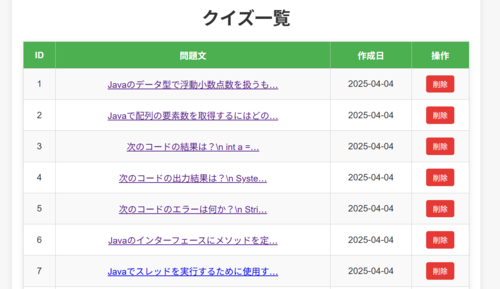

# クイズアプリ（Quiz Application）

このアプリは、Spring Boot + JPA + Thymeleaf を使用して作成されたクイズ管理システムです。管理者はクイズの登録、編集、削除ができ、ユーザーはランダムに出題されるクイズに挑戦できます。

## 📷 スクリーンショット

  
  
  


---

## 📌 主な機能

- クイズの新規登録／編集／削除
- クイズ一覧表示
- クイズのランダム出題（10問）
- 解答後に解説を表示
- クイズの作成日時／更新日時の管理
- Thymeleafテンプレートによる画面描画

---

## ⚙️ 使用技術

| 技術             | バージョン       |
|------------------|------------------|
| Java             | 17 以上          |
| Spring Boot      | 3.x              |
| Spring Data JPA  |                  |
| PostgreSQL       |                  |
| Thymeleaf        |                  |
| Lombok           |                  |
| Maven            |                  |

---

## 🚀 セットアップ方法

### 1. リポジトリのクローン

```bash
git clone https://github.com/mayako1229/quiz.git
cd quiz
```

### 2. PostgreSQL の設定

データベース quiz を作成します

```bash
psql -U postgres

```
```sql
CREATE DATABASE quiz;

```
schema.sql→data.sqlの順に実行します


src/main/resources/application.properties にデータベース接続情報を設定します

```properties
spring.datasource.url=jdbc:postgresql://localhost:5432/quizapp
spring.datasource.username=あなたのユーザー名
spring.datasource.password=あなたのパスワード
spring.jpa.hibernate.ddl-auto=update
spring.jpa.show-sql=true
spring.jpa.properties.hibernate.format_sql=true
```

### 3. アプリの起動

```bash
./mvnw spring-boot:run
```

### 4. アクセスURL

```
http://localhost:8080/
```

---

## 🗃️ データベース構成

| テーブル名 | フィールド |
|------------|------------|
| quizzes    | id（PK）, question, choice1〜4, answer, description, created_at, updated_at |

※ `answer` は 1〜4 の整数で選択肢を示します。

---

## 📂 ディレクトリ構成

```
quiz
├── controller/     # 画面遷移・ルーティング
├── dto/            # データ転送用オブジェクト
├── entity/         # エンティティクラス
├── repository/     # DBアクセス層
├── service/        # サービス層
├── form/           # フォーム
├── templates/      # Thymeleafテンプレート
├── resource/sql/   # SQL
├── resource/static/css/     # スタイルシート
├── resource/static/js/      # JavaScript
└── application.properties # 設定ファイル
```

---

## 📌 今後の改善予定

- バリデーション強化
- クイズにタグやカテゴリを追加
- クイズの正解率などを記録・分析
- モバイル対応

---

## 📄 ライセンス

このプロジェクトは MIT ライセンスのもとで公開されています。

---

## 👩‍💻 作者

- [mayako1229](https://github.com/mayako1229)
